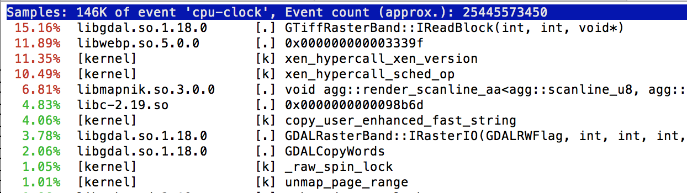
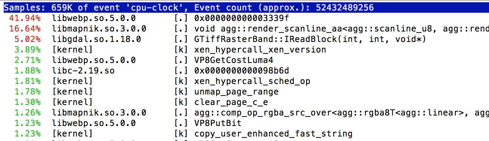

### [perf top](https://github.com/springmeyer/profiling-guide/blob/master/README.md#perf-top) profiling

During the first ~ 10 seconds of the rendering GDAL is busy filling its global cache

The callstack at this time (this graphic via Activity Monitor on OS X) looks like:

After about 15-20 seconds then GDAL is doing less work and Mapnik scaling and Webp encoding take a majority of the time:

